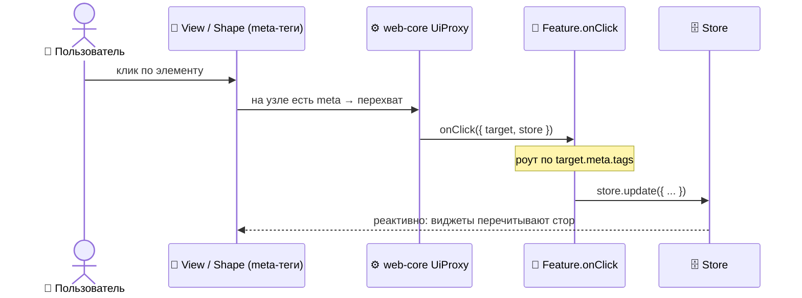

<a id="top"></a>

# 🧱 Архитектура

> 🏠 [Хаб документации](../README.md) › 🗺️ [Обзор](README.md) › **Архитектура**

> **Аудитория:** 🛠️ Разработчик · 🤖 Агент
> **Статус:** ✅ Актуально

EWC построен на **HCA (Hyper-Controlled Architecture)** фреймворка Capsule. Философия: _«UI — это тень логики»_. Интерфейс ничего не решает сам — он немо проецирует состояние, а вся власть в Feature/Controller. Связь UI ↔ логика идёт через **meta-теги** и **Proxy**, а не через колбэки.

---

## Содержание

| Раздел | Для кого |
|---|---|
| [Слои HCA в EWC](#слои-hca-в-ewc) | 🛠️ · 🤖 |
| [Стор как протокол](#стор-как-протокол) | 🛠️ · 🤖 |
| [Поток клика](#поток-клика) | 🛠️ |
| [Правила, которые держат структуру](#правила-которые-держат-структуру) | 🛠️ |
| [Карта файлов EWC](#карта-файлов-ewc) | 🛠️ · 🤖 |

---

## Слои HCA в EWC

Снизу вверх. **Запрещены восходящие и горизонтальные импорты** — любая склейка только в Widget.

| Слой | Что это | Примеры в EWC |
|---|---|---|
| **Entity** | Доменная схема (zod) + дефолты, **без UI** | [`entities/incident.tsx`](../../src/entities/incident.tsx) — схема карточки + 200 моков |
| **View** | Stateless-JSX, только Solid + типы | [`views/markersList.tsx`](../../src/views/markersList.tsx), [`views/workspaceMenu.tsx`](../../src/views/workspaceMenu.tsx), [`views/settings/mapSync.tsx`](../../src/views/settings/mapSync.tsx) |
| **Shape** | Как нарисовать сущность batch-шаблоном | [`shapes/incidentsTable.tsx`](../../src/shapes/incidentsTable.tsx) (таблица), [`shapes/incidentPreview.tsx`](../../src/shapes/incidentPreview.tsx) (превью), [`shapes/navigation.tsx`](../../src/shapes/navigation.tsx) |
| **Feature** | Доменная логика + API + side effects (FSM) | [`features/incidents.ts`](../../src/features/incidents.ts) (хаб синхронизации), [`features/auth.tsx`](../../src/features/auth.tsx), [`features/workspace.tsx`](../../src/features/workspace.tsx) |
| **Widget** | Композиция View/Shape + Feature | [`widgets/tables/incidents.tsx`](../../src/widgets/tables/incidents.tsx), [`widgets/maps/world.tsx`](../../src/widgets/maps/world.tsx), [`widgets/sidebars/main.tsx`](../../src/widgets/sidebars/main.tsx) |
| **Page** | Корневой layout, оборачивает Widget | [`pages/workspace/dashboard/index.tsx`](../../src/pages/workspace/dashboard/index.tsx) |

> [!NOTE]
> **Controller** в EWC не используется — поведение живёт в Feature. Controller нужен, когда логика чисто UI-поведенческая без API; здесь же почти всё завязано на данные инцидентов, поэтому Feature.

Сверх семи слоёв EWC использует два внешних пакета Capsule:

- **`@capsuletech/web-query`** — декларативные эндпоинты: [`endpoints/incidents.ts`](../../src/endpoints/incidents.ts), [`endpoints/auth.ts`](../../src/endpoints/auth.ts). Моки отдаются через `preRequest` без сети.
- **`@capsuletech/web-renderer`** — рендер формы по JSON-схеме: [`rendererSchemes/incidentCard.ts`](../../src/rendererSchemes/incidentCard.ts) → детальная карточка.

## Стор как протокол

Это **главный приём EWC**. Виджеты не зовут друг друга и не передают колбэки (это запрещено правилом _No Horizontal Imports_). Вместо этого:

1. Все виджеты обёрнуты в одну Feature ([`Features.Incidents`](../../src/features/incidents.ts)) и читают **один стор**.
2. Кликабельный элемент несёт **meta-теги** + `payload` — не имя метода. Например, строка таблицы: `tags: ['incident', 'table']`, `payload: { id }`.
3. `web-core` перехватывает клик и зовёт **универсальный `onClick`-роутер** фичи, который резолвит действие по тегам и **мутирует стор**.
4. Каждый виджет реактивно читает стор и решает, как реагировать.

**Мутация стора и есть протокол синхронизации.** Никаких прямых связей между виджетами. Полный разбор — [🔗 Синхронизация карты и таблицы](../01-features/map-table-sync.md).

## Поток клика



Ключевое: **UI не знает, что произойдёт** от клика. Он лишь помечает элемент тегами. Решение принимает Feature. Это и есть «UI — тень».

## Правила, которые держат структуру

| Правило | Что значит для EWC |
|---|---|
| **No Upward Imports** | View не импортирует Widget, Shape не импортирует Feature |
| **No Horizontal Imports** | Таблица не знает о карте — только общий стор |
| **Stateless View / Shape** | Вся реактивность приходит сверху, View чистый |
| **Composition Only in Widgets** | Склейка «View + Feature» — только на уровне Widget/Page |

Эти правила проверяет AST-линтер `@capsuletech/compliance` (режим `warn`) на dev-сервере.

## Карта файлов EWC

```
apps/ewc/src/
├── entities/incident.tsx          🟦 схема карточки + моки
├── views/                         🟩 stateless UI
│   ├── markersList.tsx            маркеры на карте
│   ├── workspaceMenu.tsx          бургер-меню (layout/settings/theme/logout)
│   ├── authFormCard.tsx           форма входа
│   └── settings/{mapSync,tableSync}.tsx   тумблеры синхронизации
├── shapes/                        🟨 презентация сущностей
│   ├── incidentsTable.tsx         таблица (columns + sorting)
│   ├── incidentPreview.tsx        превью-карточка
│   └── navigation.tsx             верхняя навигация
├── features/                      🟥 логика + API
│   ├── incidents.ts               ★ хаб синхронизации
│   ├── auth.tsx                   вход (FSM idle→submitting)
│   └── workspace.tsx              logout
├── widgets/                       🟪 композиция
│   ├── tables/incidents.tsx       таблица + стор
│   ├── maps/world.tsx             карта + стор
│   ├── sidebars/main.tsx          превью + кнопка
│   ├── headers/main.tsx           навигация + меню
│   └── forms/auth/{login,register}.tsx
├── pages/                         ⬛ маршруты
│   ├── _public/{login,register}.tsx
│   └── workspace/{dashboard,cards,map,reports}/...
├── endpoints/{auth,incidents}.ts  🌐 web-query (моки)
└── rendererSchemes/incidentCard.ts 📄 web-renderer ISchema
```

---

> ⬅️ [Продукт](product.md) · [Словарь](glossary.md) ➡️
> 🏠 [К хабу документации](../README.md) · ⬆️ [Наверх](#top)
