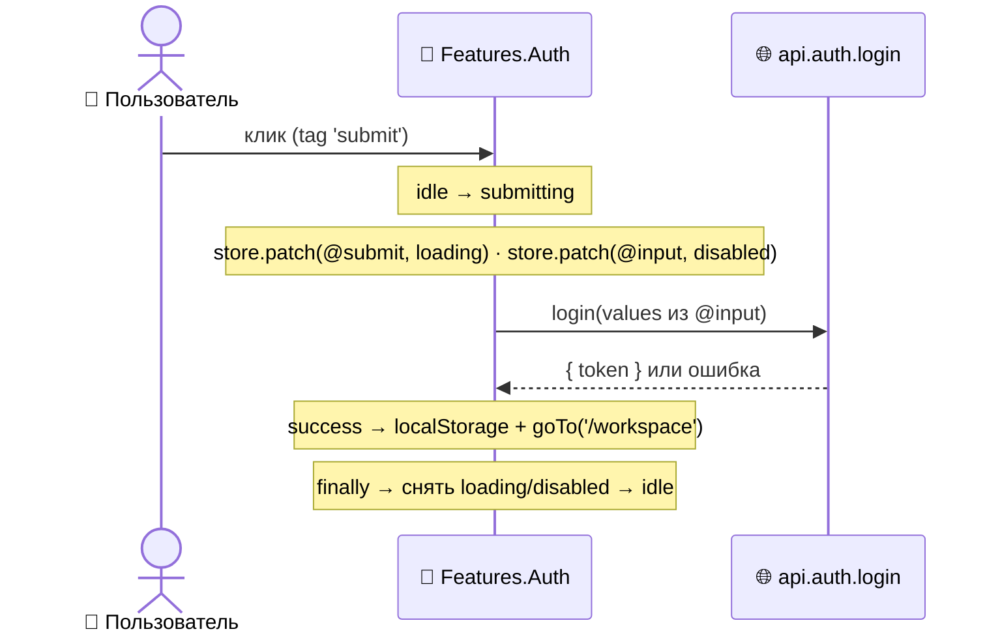

<a id="top"></a>

# 🔐 Авторизация

> 🏠 [Хаб документации](../README.md) › ✅ [Фичи](README.md) › **Авторизация**

> **Аудитория:** 👤 Юзер · 🛠️ Разработчик · 📊 Менеджер
> **Статус:** 🟡 Demo _(mock-креды, токен в localStorage)_

Вход и выход. Форма входа показывает loading-состояние (спиннер на кнопке, заблокированные поля) во время проверки.

> 🖼️ **Скриншот:** _Экран входа с loading-состоянием на кнопке._ `../assets/auth-login.png`

---

## Содержание

| Раздел | Для кого |
|---|---|
| [Что это и зачем](#что-это-и-зачем) | 📊 · 👤 |
| [Как работает под капотом](#как-работает-под-капотом) | 🛠️ |
| [Шероховатости](#шероховатости) | 🛠️ · 📊 |

---

## Что это и зачем

| 👤 Вы сделали | | ⚡ Что происходит |
|---|:---:|---|
| Ввели логин/пароль, нажали **Sign in** | → | ⏳ кнопка показывает загрузку, поля блокируются |
| Креды верны | → | ✅ переход в `/workspace` |
| Креды неверны | → | ❌ остаёмся на форме (ошибка в консоли) |
| Меню (☰) → **Logout** | → | 🚪 токен сброшен, переход на `/login` |

> [!NOTE]
> **Mock-креды demo-версии:** логин **`user`**, пароль **`123`**. Любые другие отклоняются.

## Как работает под капотом

🛠️ _Для разработчиков._

### FSM входа: `idle → submitting → idle`

[`features/auth.tsx`](../../src/features/auth.tsx) — машина из двух состояний:



Ключевые приёмы фреймворка на этом примере:

| Приём | Где |
|---|---|
| Per-state lifecycle (`onInit`/`onExit`) | `submitting.onInit` запускает API-вызов |
| Tag-based patches | `store.patch(['@submit'], { loading })` подсвечивает кнопку по тегу |
| Сбор формы по alias-зонтику | `store.values(['@input'])` собирает все поля с тегом `input` |
| Авто-инжект kind-тегов | UiProxy сам вешает `input`/`button` — в View их в `meta` нет |

Алиасы `@input` / `@submit` объявлены в [`capsule.app.ts`](../../capsule.app.ts).

### Выход

[`features/workspace.tsx`](../../src/features/workspace.tsx) ловит тег `logout` в шапке:

```ts
if (tags.includes('logout')) {
  localStorage.removeItem('capsule-auth-token');
  router.goTo('/login');
}
```

### Эндпоинт-мок

[`endpoints/auth.ts`](../../src/endpoints/auth.ts) отдаёт ответ через `preRequest` без сети: `user`/`123` → `{ token }`, иначе — `reject`. Задержка 800 мс симулирует round-trip, чтобы был виден submitting-state.

## Шероховатости

| ⚠️ | Что |
|---|---|
| 🔓 | Авторизация **условная**: один mock-пользователь, токен в `localStorage`, без refresh/expiry. |
| 🛡️ | Нет защиты маршрутов по токену на уровне роутера — `/workspace` открывается и без входа. Закрывается при подключении реального бэкенда — [Бэклог платформы](../03-roadmap/backlog/platform.md). |
| 📋 | Регистрация (`/register`) — форма есть, бэкенда нет. |

---

> ⬅️ [Карточка происшествия](incident-card.md) · [Все фичи](README.md) ➡️
> 🏠 [К хабу документации](../README.md) · ⬆️ [Наверх](#top)
