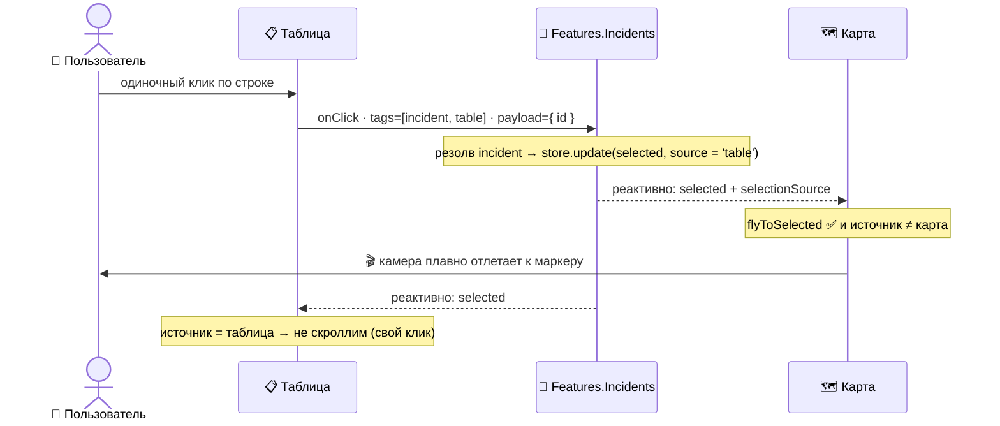

<a id="top"></a>

# 🔗 Синхронизация карты и таблицы

> 🏠 [Хаб документации](../README.md) › ✅ [Фичи](README.md) › **Синхронизация карты и таблицы**

> **Аудитория:** 👤 Юзер · 🛠️ Разработчик · 📊 Менеджер
> **Статус:** ✅ Готово _(виртуальный скролл таблицы пока на `plain`-режиме — см. [Известные проблемы](../03-roadmap/known-issues.md))_

Таблица инцидентов, карта с маркерами и сайдбар-превью работают как **единое целое**: выбрал инцидент в одном виджете — два других реагируют. Это ключевая «фишка» EWC и центральный архитектурный приём всего приложения.

> 🖼️ **Скриншот:** _Три виджета синхронно подсвечивают выбранный инцидент._ `../assets/map-table-sync.png`

> [!TIP]
> **Если вы менеджер и читаете только один абзац:** клик по строке в таблице — карта плавно отлетает к месту происшествия. Клик по маркеру на карте — таблица прокручивается к нужной строке. «Умные» реакции опциональны и включаются тумблерами, чтобы не мешать, когда не нужны.

---

## Содержание

| Раздел | Для кого |
|---|---|
| [Что это и зачем](#что-это-и-зачем) | 📊 Менеджер · 👤 Юзер |
| [Как работает под капотом](#как-работает-под-капотом) | 🛠️ Разработчик |
| [How-to — включить и пользоваться](#how-to--включить-и-пользоваться) | 👤 Юзер |
| [Шероховатости и ограничения](#шероховатости-и-ограничения) | 🛠️ Разработчик · 📊 Менеджер |

---

## Что это и зачем

Три виджета на экране «Дашборд» смотрят в **один общий источник данных** — список инцидентов. Выбор инцидента — это не «событие таблицы» и не «событие карты», а изменение **общего состояния**, на которое каждый виджет реагирует по-своему.

Наглядно — **что сделали вы → что происходит само:**

| 👤 Вы сделали | | ⚡ Что происходит автоматически |
|---|:---:|---|
| Клик по **строке** в таблице | → | 🗺️ карта отлетает к месту происшествия · 📄 в сайдбаре карточка инцидента |
| Клик по **маркеру** на карте | → | 📋 таблица скроллится к нужной строке · 📄 в сайдбаре карточка инцидента |

**Два типа взаимодействия:**

| Действие | Что происходит |
|---|---|
| **Одиночный клик** по строке или маркеру | Инцидент становится _выбранным_ — подсвечивается строка, активируется маркер, в сайдбаре появляется превью-карточка |
| **Двойной клик** | Сразу открывается детальная карточка инцидента (`/workspace/cards/:id`) |

**«Умные» реакции (опционально, по тумблеру):**

- 🗺️ **Карта отлетает к выбранному** — выбрал строку в таблице → камера плавно перелетает к маркеру.
- 📋 **Таблица скроллится к выбранному** — кликнул маркер на карте → таблица прокручивается к этой строке.

> [!IMPORTANT]
> Реакция срабатывает **только на выбор из другого виджета**. Клик по строке не заставляет таблицу прыгать к самой себе, а клик по маркеру не двигает карту, которая и так на этом маркере. Это сделано намеренно — иначе интерфейс «дёргался» бы на каждый собственный клик.

---

## Как работает под капотом

🛠️ _Эта секция — для разработчиков и агентов. Юзерам можно сразу к [How-to](#how-to--включить-и-пользоваться)._

### Принцип: стор как протокол

В EWC **нет отдельного контроллера синхронизации**. Источник правды — состояние фичи [`Features.Incidents`](../../src/features/incidents.ts). Виджеты не общаются друг с другом напрямую (это запрещено правилом _No Horizontal Imports_) — они только читают и пишут общий стор. **Мутация стора и есть протокол синхронизации.**

Форма состояния — [`features/incidents.ts:45`](../../src/features/incidents.ts#L45):

```ts
interface IIncidentsContext {
  items: IIncident[];                 // загруженный список
  selected: IIncident | null;         // выбранная карточка (готова к отрисовке)
  flyToSelected: boolean;             // тумблер: карта отлетает?  (по умолчанию false)
  scrollToSelected: boolean;          // тумблер: таблица скроллится? (по умолчанию false)
  selectionSource: 'table' | 'map' | null;  // кто инициировал выбор
}
```

### Шаг 1. Клик несёт meta-теги, а не колбэк

Ни таблица, ни карта не вызывают именованных методов. Каждый кликабельный элемент помечен **meta-тегами** + `payload`, а `web-core` сам перехватывает клик:

- строка таблицы → `tags: ['incident', 'table']` + `payload: { id }` — [`widgets/tables/incidents.tsx:27`](../../src/widgets/tables/incidents.tsx#L27)
- маркер карты → `tags: ['incident', 'map']` + `payload: { id }` — [`views/markersList.tsx:21`](../../src/views/markersList.tsx#L21)

### Шаг 2. Универсальный onClick-роутер резолвит выбор

Один обработчик `onClick` на верхнем уровне фичи ловит клик в любом состоянии и роутит по тегам — [`features/incidents.ts:82`](../../src/features/incidents.ts#L82):

```ts
onClick: ({ target, store }) => {
  const tags = target.meta?.tags ?? [];
  if (tags.includes('incident')) {
    const id = target.payload?.id;
    const item = store.ctx.data.items.find((i) => i.id === id);
    // источник выбора берём из тега виджета — таблица или карта
    const source = tags.includes('table') ? 'table' : tags.includes('map') ? 'map' : null;
    store.update({ selected: structuredClone(unwrap(item)), selectionSource: source });
  }
}
```

> [!WARNING]
> `structuredClone(unwrap(item))` — не косметика. Если положить «живой» узел стора `items[k]` в поле `selected`, `@xstate/solid` при reconcile **сшивает** их в один прокси, и следующий выбор портит исходный `items[k]`. Глубокая копия разрывает алиасинг. Подробнее — комментарий в [`features/incidents.ts:95`](../../src/features/incidents.ts#L95).

### Шаг 3. Виджеты реагируют, сверяясь с источником

Каждый виджет реактивно читает `selected` и решает, реагировать ли — сверяясь с `selectionSource` и своим тумблером:

**Карта** — [`widgets/maps/world.tsx:23`](../../src/widgets/maps/world.tsx#L23):
```ts
flyToSelected && selected && selectionSource !== 'map'   // ← не реагируем на свой же клик
  ? [selected.location.lng, selected.location.lat]        //   передаём в <Ui.MapView flyTo={...}>
  : undefined
```

**Таблица** — [`widgets/tables/incidents.tsx:33`](../../src/widgets/tables/incidents.tsx#L33):
```ts
scrollToSelected && selectionSource !== 'table'          // ← не скроллим к своей же строке
  ? selected.id                                          //   передаём в <Shapes.IncidentsTable scrollToId={...}>
  : undefined
```

### Шаг 4. Тумблеры — это тоже теги

Кнопки в settings-стрипе ничего не мутируют сами — несут тег, а флипает флаг всё тот же `onClick`-роутер:

- `toggle-fly` → флипает `flyToSelected` — [`views/settings/mapSync.tsx:14`](../../src/views/settings/mapSync.tsx#L14) → [`features/incidents.ts:108`](../../src/features/incidents.ts#L108)
- `toggle-scroll` → флипает `scrollToSelected` — [`views/settings/tableSync.tsx:14`](../../src/views/settings/tableSync.tsx#L14) → [`features/incidents.ts:111`](../../src/features/incidents.ts#L111)

### Полный поток: клик в таблице → карта отлетает



Симметрично работает обратное направление: клик по маркеру → `selectionSource: 'map'` → таблица скроллится, карта не двигается.

### Где всё это собирается

Все три виджета обёрнуты в один `<Features.Incidents>`, а тумблеры смонтированы в `settings`-слоты Matrix — [`pages/workspace/dashboard/index.tsx:19`](../../src/pages/workspace/dashboard/index.tsx#L19).

---

## How-to — включить и пользоваться

👤 _Пошаговые рецепты для пользователя._

### Базовый выбор (работает всегда, без настройки)

1. **Одиночный клик** по строке таблицы или маркеру на карте → инцидент выделяется, в сайдбаре справа появляется превью-карточка.
2. **Двойной клик** → открывается детальная карточка инцидента.

### Включить «карта отлетает к выбранному»

1. Открой меню в правом верхнем углу (☰).
2. В группе **Widget settings** включи тумблер — на виджетах появится строка настроек.
3. На карте нажми **«Подлетать к выбранному»** (станет `✓`).
4. Теперь клик по строке в таблице → карта плавно отлетает к месту происшествия.

> 📎 Детальный разбор: [How-to → Карта отлетает к инциденту](../02-how-to/fly-map-to-incident.md)

### Включить «таблица скроллится к выбранному»

1. Меню (☰) → **Widget settings** → включить.
2. На таблице нажми **«Скроллить к выбранному»** (станет `✓`).
3. Теперь клик по маркеру на карте → таблица прокручивается к нужной строке.

> 📎 Детальный разбор: [How-to → Таблица скроллится к маркеру](../02-how-to/scroll-table-to-marker.md)

> [!NOTE]
> Тумблеры независимы — можно включить любую реакцию по отдельности или обе сразу. По умолчанию обе выключены.

---

## Шероховатости и ограничения

| ⚠️ | Что | Подробнее |
|---|---|---|
| 🚧 | Таблица работает в `plain`-режиме (без виртуализации) из-за бага виртуального скролла в UI-ките. На больших списках это менее эффективно. | [Известные проблемы](../03-roadmap/known-issues.md) |
| 📋 | Нет анимации самого перелёта «по дуге» / подсветки трассы — только нативный `flyTo` MapLibre. | [Бэклог карты](../03-roadmap/backlog/map.md) |

---

> ⬅️ [Все фичи](README.md) · [Таблица инцидентов](table.md) ➡️
> 🏠 [К хабу документации](../README.md) · ⬆️ [Наверх](#top)
